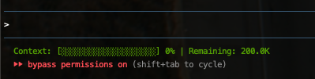

# Claude Code Context Statusline

A visual context window usage indicator for Claude Code terminal statusline.

[한국어](README.ko.md)

## Features

- 📊 **Progress Bar**: Visual representation of context usage
- 🎨 **Color-coded**: Green → Yellow → Red based on usage
- 📈 **Real-time Updates**: Shows current context percentage and remaining tokens
- 🔄 **Auto-reset**: Resets to 0% after `/clear` command
- 💾 **Compression Alert**: Shows "(Compressed)" when exceeding 100%

## Preview



**Color indicators:**
- 🟢 Green: < 60% usage
- 🟡 Yellow: 60-85% usage
- 🔴 Red: > 85% usage

## Quick Install

### One-line installation (recommended)

**Using curl:**
```bash
bash <(curl -fsSL https://raw.githubusercontent.com/yangs1202/claude-code-context/main/install.sh)
```

**Using wget:**
```bash
bash <(wget -qO- https://raw.githubusercontent.com/yangs1202/claude-code-context/main/install.sh)
```

### Manual installation

```bash
# Clone the repository
git clone git@github.com:yangs1202/claude-code-context.git
cd claude-code-context

# Run installation script
./install.sh
```

## Requirements

- Claude Code v2.0+
- `jq` (JSON processor)
- `awk` (text processor)

**Install dependencies:**

```bash
# macOS
brew install jq

# Ubuntu/Debian
sudo apt-get install jq

# RHEL/CentOS
sudo yum install jq
```

## What Gets Installed

The installer will:
1. ✅ Check dependencies (jq, awk)
2. ✅ Install `statusline.sh` to `~/.claude/`
3. ✅ Update `~/.claude/settings.json`
4. ✅ Create backup of existing settings
5. ✅ Set proper permissions

## Manual Setup

If you prefer manual installation:

1. Copy `statusline.sh` to `~/.claude/`:
   ```bash
   cp statusline.sh ~/.claude/
   chmod +x ~/.claude/statusline.sh
   ```

2. Add to `~/.claude/settings.json`:
   ```json
   {
     "statusLine": {
       "type": "command",
       "command": "~/.claude/statusline.sh"
     }
   }
   ```

3. Restart Claude Code

## Uninstallation

### Quick uninstall

```bash
bash <(curl -fsSL https://raw.githubusercontent.com/yangs1202/claude-code-context/main/uninstall.sh)
```

### Manual uninstall

```bash
# If you cloned the repository
cd claude-code-context
./uninstall.sh
```

Or manually remove:
```bash
rm ~/.claude/statusline.sh
rm /tmp/claude-statusline-state
# Remove "statusLine" from ~/.claude/settings.json
```

## How It Works

The script:
1. Receives JSON data from Claude Code via stdin
2. Tracks `session_id` to detect `/clear` commands
3. Calculates context usage by comparing current tokens with baseline
4. Displays a color-coded progress bar with percentage and remaining tokens

When you run `/clear`, the session ID changes and the counter resets to 0%.

## Troubleshooting

**Status bar not showing?**
- Make sure you've restarted Claude Code after installation
- Check that `~/.claude/statusline.sh` exists and is executable
- Verify `statusLine` is in your `~/.claude/settings.json`

**Status bar not updating after `/clear`?**
- The script automatically tracks session changes
- Try restarting Claude Code

**Dependencies missing?**
- Install `jq`: See [Requirements](#requirements) section above

**Colors not showing?**
- Make sure your terminal supports ANSI colors
- Try a different terminal emulator

## Contributing

Contributions are welcome! Please feel free to submit a Pull Request.

## License

MIT License - see [LICENSE](LICENSE) file for details

## Credits

Created for the Claude Code community to help monitor context usage more effectively.
